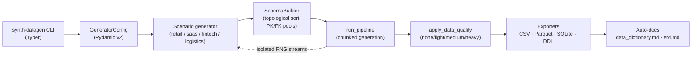

# synth-datagen

> Realistic synthetic business data — referential integrity, deterministic seeding, and quality injection you control.

[](https://github.com/ryszard-twardy/synth-datagen/actions/workflows/ci.yml)
[](https://www.python.org/)
[](LICENSE)
[](https://ryszard-twardy.github.io/synth-datagen/)

Generate multi-table relational datasets — retail, SaaS, fintech, logistics — with stable PK/FK formats, business-rule coherence across tables, and configurable data-quality issues you can inject on demand. Built for ETL practice, dashboard demos, and reproducible analytics portfolios. Same seed always yields byte-identical CSVs.

## Quickstart

### From source (today)

```bash
git clone https://github.com/ryszard-twardy/synth-datagen
cd synth-datagen
uv venv && source .venv/bin/activate    # PowerShell: .\.venv\Scripts\Activate.ps1
uv pip install -e ".[test]"
synth-datagen retail --seed 42 --output ./out/retail \
    --rows fact_orders=500,fact_order_items=1500,fact_payments=500 \
    --export-parquet
```

### From PyPI (from v0.2.0 onward)

```bash
pip install synth-datagen
synth-datagen retail --seed 42 --output ./out/retail \
    --rows fact_orders=10000,fact_order_items=30000,fact_payments=10000
```

You now have a clean retail star schema (5 dim + 3 fact + 1 bridge table) as CSV, plus an auto-generated `data_dictionary.md`, Mermaid `erd.md`, and a `schema.sql` DDL file ready to load into Postgres / MySQL / SQLServer / SQLite.

## Why this exists

Faker handles names and emails; it doesn't give you `fact_orders` rows whose `customer_id` actually appears in `dim_customers`, whose payment totals reconcile to line-item subtotals, or whose order-item counts match the header. Public datasets (Kaggle, UCI) are static, undocumented, and rarely include the kind of intentional-but-realistic data quality issues you need to demonstrate cleaning logic. Hand-rolled SQL fixtures rot the moment your schema changes.

`synth-datagen` sits in the gap. It generates **business-coherent multi-table data** for four scenarios out of the box, gives you four levels of quality injection (`none / light / medium / heavy`), and emits CSV + Parquet + DDL + a data dictionary + an ERD from a single CLI call. Every generation is fully reproducible from `--seed`.

## Features

- **Four scenarios:** retail, SaaS, fintech, logistics — each a star schema with realistic dim/fact/bridge structure.
- **Three sub-apps:** Kupferkanne RFM (monthly fact shards from YAML), monthly-sales (period-windowed retail), SaaS v3 (audit-grade dirty-CSV pipeline with per-check defect rates).
- **Referential integrity** across tables — FKs reconcile, totals sum, timelines are valid.
- **Configurable quality injection:** `--data-quality {none,light,medium,heavy}` toggles missing values, format drift, duplicates, and out-of-range outliers without breaking PK/FK structure.
- **Reproducible:** identical `--seed` → identical bytes (verified by property tests in CI).
- **Auto-documentation:** every run emits `data_dictionary.md` + Mermaid `erd.md` next to the data.
- **Multi-dialect DDL:** Postgres, SQLite, MySQL, SQL Server.
- **Multi-format exports:** CSV (always), Parquet (`--export-parquet`), SQLite (`--export-sqlite`), DML inserts (`--export-dml`).
- **Production-style IDs:** fixed-format strings (`CU00000001`, `OR00000001`) and warehouse-style `YYYYMMDD` date keys.
- **Python 3.11 / 3.12 / 3.13.**

## Scenarios

```bash
synth-datagen scenarios   # list all four
```

| Scenario | What it models | Tables |
|---|---|---|
| `retail` | E-commerce orders with customer segments, promotions, payments | `dim_customers`, `dim_products`, `dim_stores`, `dim_date`, `dim_promotions`, `fact_orders`, `fact_order_items`, `fact_payments`, `bridge_order_promotions` |
| `saas` | B2B SaaS with subscriptions, usage, invoices | `accounts`, `users`, `features`, `subscriptions`, `feature_usage`, `events`, `invoices` |
| `fintech` | Payment ledger with cards, merchants, loans | `customers`, `accounts`, `cards`, `merchants`, `transactions`, `loans`, `loan_payments` |
| `logistics` | Shipping with warehouses, carriers, inventory | `warehouses`, `suppliers`, `products`, `inventory`, `carriers`, `shipments`, `shipment_items` |

Each accepts the same flags:

```bash
synth-datagen <scenario> [OPTIONS]

  --seed INTEGER                       Random seed (default 42)
  --output, -o PATH                    Output directory (default ./out)
  --rows, -r TEXT                      Per-table overrides, e.g. "fact_orders=200000,dim_customers=50000"
  --dialect, -d {postgres|sqlite|mysql|sqlserver}
  --data-quality, --dq {none|light|medium|heavy}
  --export-sqlite / --no-sqlite
  --export-parquet / --no-parquet
  --export-dml / --no-dml
  --discount-variation / --no-discount-variation   (retail only)
  --chunk-size INTEGER                 Rows per generation chunk
  --cols-min / --cols-max INTEGER      Auto-table column-count window
```

See [docs/scenarios/](https://ryszard-twardy.github.io/synth-datagen/scenarios/retail/) for full schema details and per-scenario sample output.

## Architecture



**RNG isolation.** A single `--seed` derives a tree of independent generators (`numpy.random.SeedSequence.spawn`) so each table — and each chunk within a table — gets its own RNG. Adding rows to one table doesn't shift values in another, which is what makes the byte-equality property tests possible. See [docs/architecture/rng-isolation.md](https://ryszard-twardy.github.io/synth-datagen/architecture/rng-isolation/).

## Examples

Three runnable scripts in [`examples/`](examples/):

```bash
python examples/quickstart_retail.py     # ~6 s,  21 files
python examples/quickstart_saas.py       # ~2 s,  10 files (DQ=medium)
python examples/kupferkanne_full.py      # ~5 min, 83 files (full 39-month period)
```

Each script header documents the equivalent `synth-datagen` shell invocation.

## Configuration

Most CLI options map 1:1 to fields on `GeneratorConfig` — the same Pydantic model the pipeline consumes. The Kupferkanne RFM and SaaS v3 sub-apps are YAML-driven; example configs live in [`configs/`](configs/) and the schemas are documented at [docs/scenarios/](https://ryszard-twardy.github.io/synth-datagen/scenarios/saas/).

## Development

```bash
git clone https://github.com/ryszard-twardy/synth-datagen
cd synth-datagen
uv venv
source .venv/bin/activate                # PowerShell: .\.venv\Scripts\Activate.ps1
uv pip install -e ".[test,docs]"
pre-commit install
pytest                                   # fast lane (~60 s, slow tests skipped)
pytest -m 'slow or not slow'             # full suite (CI runs this)
```

CI matrix runs Python 3.11 / 3.12 / 3.13 on Ubuntu with ruff lint + format-check, mypy (advisory), bandit `-ll`, and a 80% combined coverage gate. See [CONTRIBUTING.md](CONTRIBUTING.md) for the full PR checklist and `docs/architecture/` for design notes.

## Built with

- [Typer](https://typer.tiangolo.com/) — CLI
- [Pydantic v2](https://docs.pydantic.dev/) — config validation
- [NumPy](https://numpy.org/) — RNG and statistics
- [pandas](https://pandas.pydata.org/) + [PyArrow](https://arrow.apache.org/docs/python/) — data structures and Parquet
- [Faker](https://faker.readthedocs.io/) — realistic strings
- [Hypothesis](https://hypothesis.readthedocs.io/) — property-based tests
- [MkDocs Material](https://squidfunk.github.io/mkdocs-material/) — docs site

## License

MIT. See [LICENSE](LICENSE).

## Citing

```bibtex
@software{synth_datagen,
  author = {Twardy, Ryszard},
  title  = {synth-datagen: realistic synthetic business data with referential integrity},
  year   = {2026},
  url    = {https://github.com/ryszard-twardy/synth-datagen},
  version = {0.2.0}
}
```
