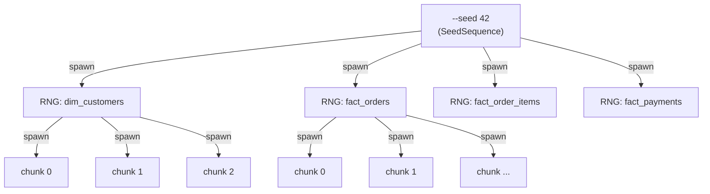

# RNG isolation

The single most important architectural choice in `synth-datagen` is how randomness is partitioned. **A single `--seed` derives a tree of independent generators, one per table and one per chunk within a table.** This is what makes byte-equal output across runs possible — and what allows you to add rows to one table without shifting any value in another.

## The problem

Naive seeding looks like:

```python
import numpy as np
rng = np.random.default_rng(seed=42)

# generate dim_customers
customers = make_customers(rng, n=10_000)
# generate fact_orders
orders = make_orders(rng, customers, n=80_000)
```

Now bump `dim_customers` to 12,000 rows. Every subsequent draw from `rng` shifts. `fact_orders` looks completely different. Every downstream table looks different. Tests break, dashboards break, snapshots break.

## The fix: isolated streams via `SeedSequence`

NumPy's `SeedSequence.spawn()` derives statistically independent child sequences from a parent seed. `synth-datagen` uses this to give every logical unit its own RNG:



Now bumping `dim_customers` to 12,000 only affects the RNG attached to `dim_customers`. Every other table's RNG is identical because it was spawned from the same parent `SeedSequence` with the same child-index. `fact_orders` is byte-identical.

## Where this lives in code

- The seed entry point is [`synth_datagen.utils.seed_everything`](https://github.com/ryszard-twardy/synth-datagen/blob/main/src/synth_datagen/utils.py), which returns the parent `SeedSequence`, a `numpy.random.Generator`, and a `Faker` instance.
- The per-table spawning happens in [`synth_datagen.rng`](https://github.com/ryszard-twardy/synth-datagen/blob/main/src/synth_datagen/rng.py) — the small RNG-factory module is intentionally separate so it can be tested in isolation.
- Faker is also seeded deterministically (`Faker.seed_instance(int_from_seed_sequence)`), so name/email values follow the same isolation rule.

## Cross-concern salt registry

The per-table spawn tree above is what isolates tables *within* a
scenario. A second, complementary mechanism — the **salt registry** —
isolates whole concerns *across* scenarios.

Some draws are logically independent of the scenario stream but
deterministic under the same `--seed`: the legacy retail discount
engine, the SaaS v3 audit pipeline, the pharma defect injector. If
they all spawned from the same parent `SeedSequence`, adding (say) a
new pharma defect would shift the bytes of an unrelated discounts
calculation.

`synth_datagen.rng.SALT_REGISTRY` solves this by XOR-ing the user's
`--seed` with a per-concern salt before constructing the
`SeedSequence`. Each entry is permanent: changing a salt would break
byte-equality for every dataset ever generated under that concern.

| Concern | Salt | Introduced |
|---|---|---|
| `master` | `0` (implicit — the user-supplied seed, untouched) | v0.1.0 |
| `discounts` | `int.from_bytes(b"D15C0UNT", "big")` (`0x44_3135_4330_554E_54`) | v0.1.0 |
| `saas_v3` | `0x5AA50000` | v0.2.1 |
| `pharma` | `0x5DDA50000` | v0.3.0 |

**Register-or-raise discipline.** Every new RNG concern MUST register
a salt in `src/synth_datagen/rng.py::SALT_REGISTRY` before being
drawn. Use `make_rng(seed, "concern").spawn(N)` to derive child
streams; calling `make_rng` with an unregistered concern raises
`KeyError` rather than silently inventing a salt — the registry is a
flight-recorder of every byte-shift surface in the project, and
implicit registration would defeat the point.

When you add a new scenario or sub-app that needs cross-scenario
isolation, pick a salt that doesn't collide with existing entries
(grep is enough — there are five), document it inline alongside the
phase that introduced it, and add a row to the table above.

## Property tests that enforce this

Three property tests in CI fail loudly if the isolation breaks:

1. **`test_*_csv_byte_equality`** — generate, hash the CSVs, regenerate with the same seed, hash again, assert equal. One per scenario.
2. **`test_*_determinism`** — generate twice in the same process, assert all dataframes equal.
3. **Hypothesis property tests** — for each scenario, assert that adding rows to a single table doesn't change any other table's CSV bytes. (This is the strongest form: it verifies isolation, not just determinism.)

These run in the slow CI lane.

## Why not just `numpy.random.SeedSequence(seed).spawn(N)` once?

Two reasons:

1. **Variable table count.** Some scenarios have 7 tables, some have 9. A flat spawn list ties the seed indices to the table order; reordering tables in the schema breaks reproducibility for old seeds. Per-name spawning (`spawn_one(parent, name="dim_customers")`) decouples seed identity from table order.
2. **Chunk-level isolation.** Generating in chunks (controlled by `--chunk-size`) means each chunk needs its own RNG so the bytes are identical regardless of `--chunk-size`. Without per-chunk spawning, a user changing `--chunk-size` from 50,000 to 10,000 would see different output.

## Reading the data dictionary

Every generated `data_dictionary.md` carries the seed in its header. If you check in a generated dataset, future-you can regenerate it exactly with `synth-datagen <scenario> --seed <that-seed> ...`. There is no "approximate match" — the bytes are equal or there's a bug.
