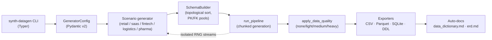

# synth-datagen

> Realistic synthetic business data — referential integrity, deterministic seeding, and quality injection you control.

`synth-datagen` generates multi-table relational datasets — retail, SaaS, fintech, logistics, pharma — with stable PK/FK formats, business-rule coherence across tables, and configurable data-quality issues you can inject on demand. Built for ETL practice, dashboard demos, and reproducible analytics portfolios. Same seed always yields byte-identical CSVs.

## What this looks like

A single `synth-datagen retail` invocation lands you with:

```text
out/retail/
├── dim_customers.csv          ← 5 dim tables (customers, products, stores, date, promotions)
├── dim_products.csv
├── ...
├── fact_orders.csv            ← 3 fact tables (orders, order_items, payments)
├── fact_order_items.csv
├── fact_payments.csv
├── bridge_order_promotions.csv
├── parquet/                   ← matching Parquet (with --export-parquet)
├── schema.sql                 ← multi-dialect DDL (postgres / sqlite / mysql / sqlserver)
├── data_dictionary.md         ← auto-generated per run
└── erd.md                     ← Mermaid ER diagram, also auto-generated
```

All FKs reconcile. All payment totals match line-item subtotals. All timelines are valid. Re-run with the same `--seed` and the bytes are identical.

## Why does this exist?

Faker handles names and emails; it doesn't give you `fact_orders` rows whose `customer_id` actually appears in `dim_customers`, whose payment totals reconcile to line-item subtotals, or whose order-item counts match the header. Public datasets (Kaggle, UCI) are static, undocumented, and rarely include the kind of intentional-but-realistic data quality issues you need to demonstrate cleaning logic. Hand-rolled SQL fixtures rot the moment your schema changes.

`synth-datagen` sits in the gap. Read the [Quickstart](quickstart.md) to install it, then pick a [scenario](scenarios/index.md) to explore.

## Architecture at a glance



The thread that holds it all together is RNG isolation — see [Architecture › RNG isolation](architecture/rng-isolation.md) for how a single `--seed` derives independent generators per table and per chunk.

## Where to go next

| If you want to… | Read this |
|---|---|
| install and run a first dataset | [Quickstart](quickstart.md) |
| understand what each scenario contains | [Scenarios overview](scenarios/index.md) |
| see why output is byte-stable across runs | [Architecture › RNG isolation](architecture/rng-isolation.md) |
| understand the four `--data-quality` levels | [Architecture › Quality injection](architecture/quality-injection.md) |
| load output into Power BI / BigQuery / Postgres | [Recipes](recipes/powerbi-loading.md) |
| call the Python API directly | [API reference](api/reference.md) |
| see what changed in this release | [Changelog](changelog.md) |
